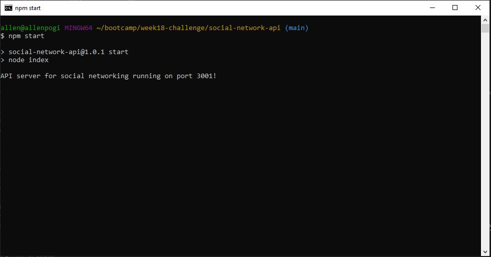
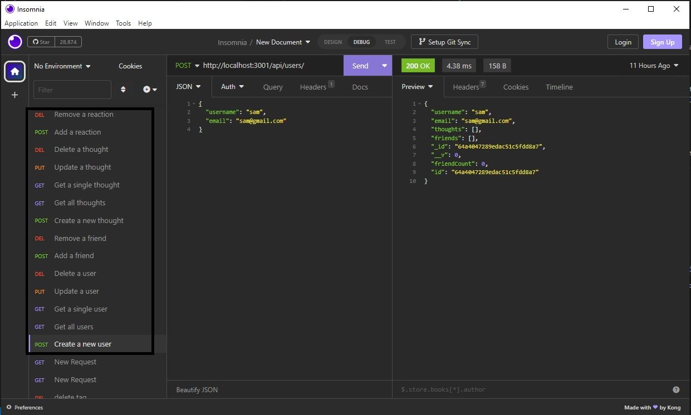

# social-network-api

## Description

This program is a backend for a social networking application

## Table of Contents
- [Installation](#installation)
- [Usage](#usage)
- [Screenshot](#screenshot)
- [Video recording](#video-recording)
- [Credits](#credits)
- [License](#license)
- [Badges](#badges)
- [Features](#features)
- [Contributing](#contributing)
- [Tests](#tests)
- [Email address](#email-address)
- [Github username](#github-username)

## Installation
Run npm install to install the dependencies.
Run the command **npm start** on the terminal to start the application.

## Usage
The program is not deployed and can only be run on the terminal. To demo the program, i used insomnia to run through all the routes for all the models.

## Screenshot

Below is a screenshot of the application when ran using command line.

Below is a screenshot of the demo using insomnia.

## Video recording

Video recording explaining the application can be viewed here: TBC

## Credits
none

## License
n/a

## Badges

## Features
The following are the functions of the program:
- create a new user
- get all users
- get a single user
- update a user
- add a friend
- remove a friend
- create a new thought
- get all thoughts
- get a single thought
- update a thought
- delete a thought
- add a reaction
- remove a reaction

## Contributing
n/a

## Tests
N/A

## Email address
allen.tuazon@gmail.com

## Github username
allentpogi